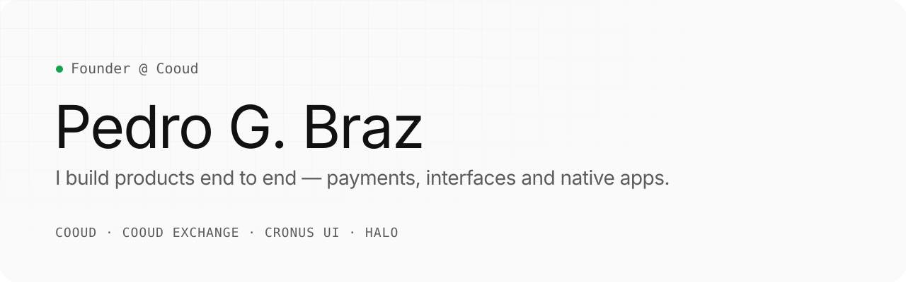

<picture>
  <source media="(prefers-color-scheme: dark)" srcset="./assets/banner-dark.svg">
  
</picture>

 

I'm a self-taught founder and product engineer from São Paulo. I run **Cooud**, a checkout and payments platform for creators, and build developer tools and native software on the side. I care about systems that hold money correctly and interfaces that feel finished.

[Website](https://pedrogbraz.com.br) · [LinkedIn](https://www.linkedin.com/in/pedrogbraz) · [X](https://x.com/pedrogbraz) · [Instagram](https://instagram.com/pedrogbraz) · [Email](mailto:contatopedrogbraz@gmail.com)

 

## Building

| Company | What it does | Status |
|:--|:--|:--|
| **[Cooud](https://cooud.com)** | Payments & checkout for creators — checkout, one-click upsell, subscriptions, affiliates, members area and mobile apps. | `Live` |
| **Cooud Exchange** | Custodial crypto exchange — order matching, multi-chain deposits and withdrawals, solvency checks. | `Building` |
| **[Cronus UI](https://aicronus.com)** | Product UI system for React — tokens, live theming, accessible components, CLI and an MCP server. [`@cronus-ui/ui`](https://www.npmjs.com/package/@cronus-ui/ui) on npm. | `v0.7` |
| **Halo** | Native macOS software for the MacBook notch — Halo Island and Halo Launch. | `Coming soon` |

 

## Labs

- **[cronus-kernel](https://github.com/pedrogbraz/cronus-kernel)** — declarative language that compiles one `.cronus` file into a single Rust binary with SQLite, REST API, server-rendered HTML and auth. Fork of Emerson Previatto's original.
- **[orchestra-os](https://github.com/pedrogbraz/orchestra-os)** — Arch + Hyprland setup with a CLI that gives each coding agent its own git worktree and container.
- **ForgeOS** — personal engineering system that routes work across models by cost and risk, with versioned memory and an eval gate.

 

## How I work

**Spec first.** Architecture decision records, runbooks and specs before code.  
**Proof over claims.** Rules that touch money or security get tests that try to break them.  
**Parallel by default.** Several coding agents at once, each in its own worktree, behind quality gates.

 

## Stack

**Product** — TypeScript · React · Next.js · Astro · Tailwind  
**Backend** — Node · Bun · Fastify · NestJS · PostgreSQL · Go · Java  
**Native** — Swift · SwiftUI · AppKit · Kotlin  
**Infra** — Docker · Terraform · Cloudflare · Vercel · Linux

 

São Paulo, Brazil · Open to conversations with investors and partners → <a href="https://pedrogbraz.com.br">pedrogbraz.com.br</a>
